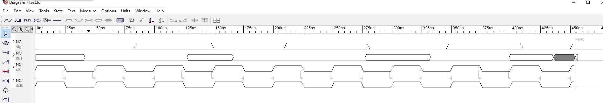
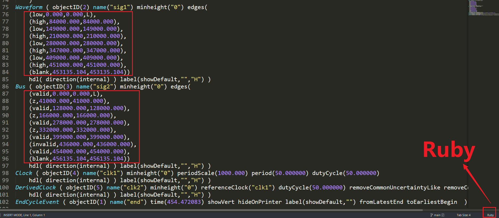
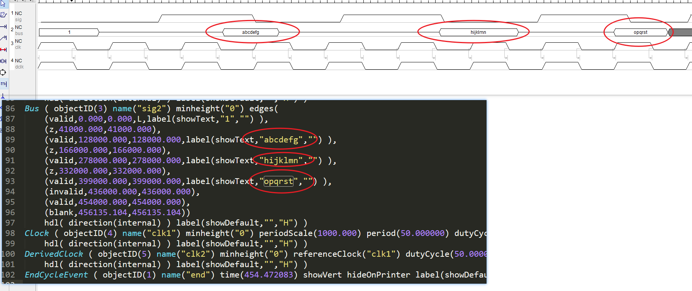

# FormatTimingDesigner

## 前言

因为在TimingDesigner中用鼠标点击波形，过去麻烦，还需要经常对齐，故创建了以下脚本，用于对齐：

1. 分别用`TimingDesigner`和`Sublime Text`打开`test.td`：

   可以看到，波形可以通过在`Sublime Text`中直接修改

   

   

2. 分别用`TimingDesigner`和`Sublime Text`打开`test2.td`：

   可以看到，都是一一对应的，因此可通过脚本直接修改`.td`文件来画波形

   

## 执行

直接运行`FormatTimingDesigner.py`中对应的函数即可

